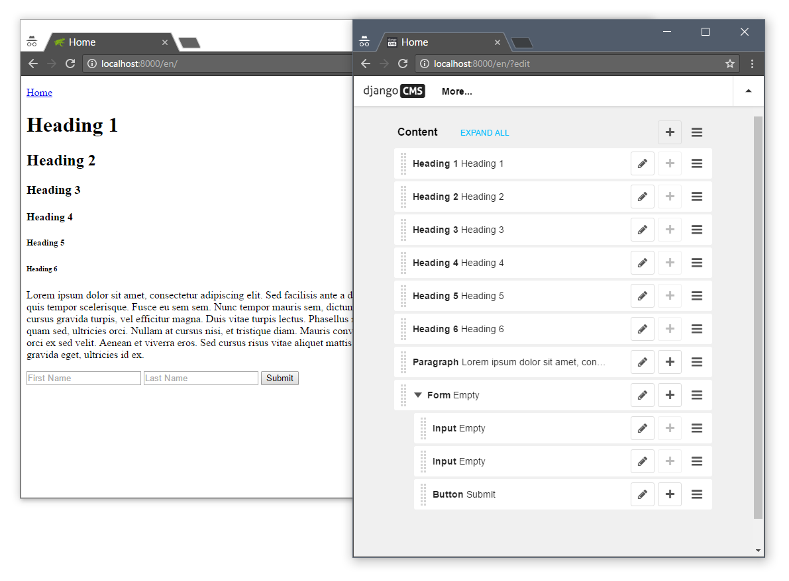

# HTML Tags




## Contribution

Using Docker & Dosh scripts:

```shell
$ dosh runserver  # to start to the contribution fastly.
$ dosh runtests  # to run the unit tests and see the coverage report.
$ dosh shell  # to use Django shell or Python REPL in the development.
```

If you don't use Docker, you can try Virtualenv instead:

```shell
$ python -m pip install virtualenv
$ virtualenv venv
$ source venv/bin/activate  # or run activate.ps1 if you use PowerShell.
$ (venv) pip install -r demo/requirements.txt
```

Demo user:

```
username: admin
password: admin
```
